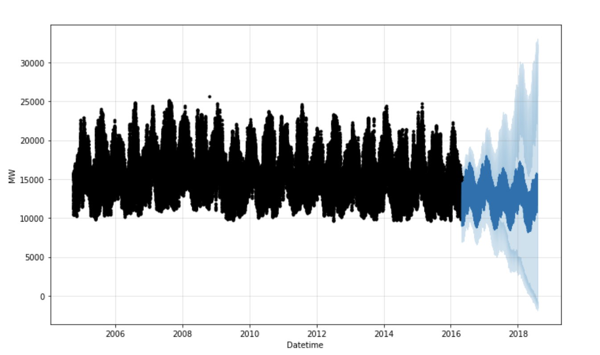
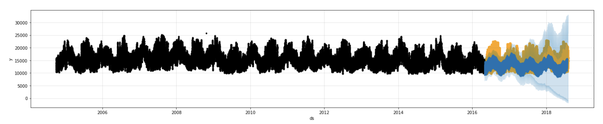

# Predicting Hourly Energy Demand using Time-Series Forecasting

## Problem Description

When it comes to energy, a big focus point is on the demand for electricity from users and when that demand occurs. Knowing when that demand will occur, and being able to plan for that is a big asset for electricity companies. It is even more relevant in recent years with the advancement of fossil-free energy sources which sometimes suffer from limitations in storage and uneven supply. Predicting hourly consumption in advance based on historical data could therefore be a great asset in trying to counter those issues.

## Tools

To implement this project we will use PySpark for the data processing and utilize its advantages in handling the big dataset we’ll use. For building a time forecasting model and predicting the consumption we will utilize Facebook’s Open Source package for forecasting, Prophet. It allows for easy handling of several forecasting parameters and built-in functions and is built on top of SciKit Learn. Finally, we’ll write our code in Jupyter Notebooks in Google Colab to allow for easy collaboration and also free GPU resources if needed. 

## Data

The dataset we have used is from Kaggle and an electric company called PJM Interconnection LLC (PJM). It gathers hourly electric consumption from the grid in different states from the last 10+ years. We’ll collect it through Kaggle’s API and transfer it to the remote machine on Google Collaboratory.
Every row contains data of:
- Date.
- Megawatt Energy Consumption.

## Methodology and Algorithm

With this big dataset, we were able to make a relatively accurate model for future consumption due to the general seasonality in the data. To utilize this seasonality where time is an important dimension, we will use time-series forecasting as the algorithm. 

The general steps and methods we used are the following:

- Gather the full-dataset
- Data cleaning, selection, and transformation
- Fit and adapt the model to our dataset
- Generate a time-series forecast for x number of hours and days forward.

## Results

Black dots in Fig.1 above represent the actual values from the training dataset, and dark blue represents the predicted values from our predictor. We also plot a confidence interval as the light blue, which you can see becomes bigger and more uncertain the longer you try to predict into the future.

In Fig.2 above we are comparing our predictions with the actual values from the dataset. Orange is the actual values in the dataset. Comparing the two we can see that our model generally captures both accuracy and seasonality of the data leading to fairly accurate predictions. 

To help us quantify the accuracy, we used MSE, MAE, and MAPE as error metrics for the model. MAPE is the most telling metric since it helps us understand the percent error on the absolute value while being unconcerned about the time series' absolute magnitude. The final MAPE was 13.61 % after some hyperparameter tuning.

| Metric  | Value  |
|---|---|
| Mean Absolute Percentage Error (MAPE) | 13.61 % |
| Mean Squared Error (MSE) | 7 297 738 MW |
| Mean Absolute Error (MAE) | 2103 MW|

## How to run the code
To run the code no special dependencies are required since it all takes place on a default Google Colaboratory machine as a notebook. You can therefore just run every cell in sequential order in the jupyter notebook and all the required setup and installations will be performed to run the code on Colab.
